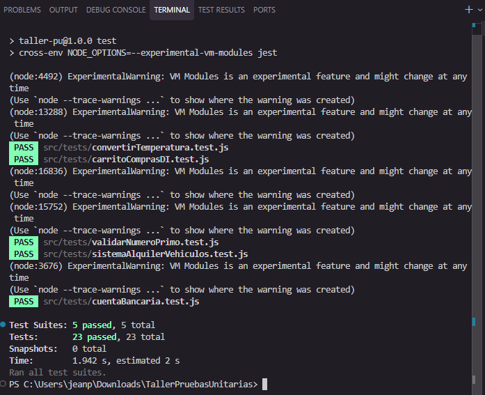
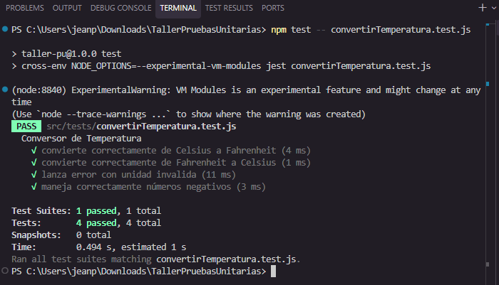
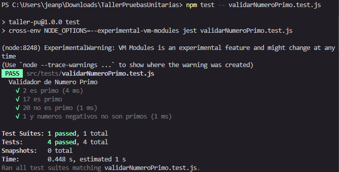
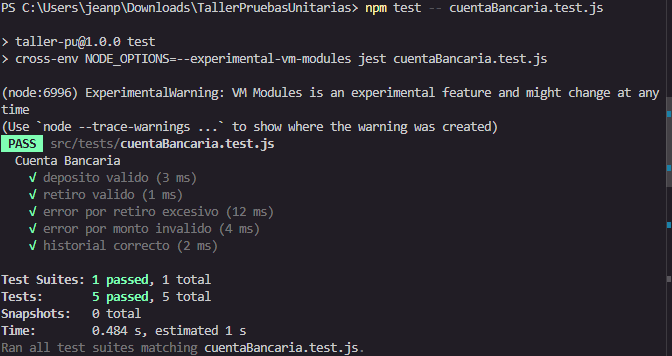
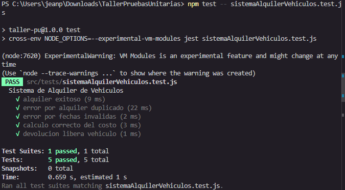
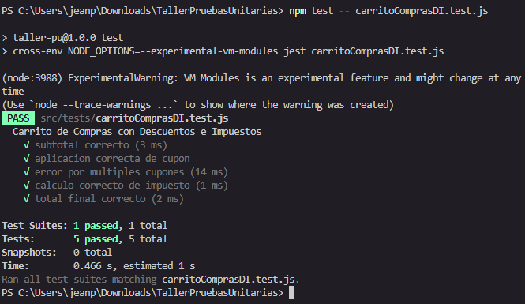

# Taller de Pruebas Unitarias con Jest

Este proyecto contiene ejercicios de pruebas unitarias en JavaScript usando Jest.

## ¿Qué hay en este proyecto?

Este taller incluye 5 ejercicios con sus respectivas pruebas:

1. **Conversor de Temperatura** - Convierte entre Celsius y Fahrenheit
2. **Validador de Números Primos** - Verifica si un número es primo
3. **Cuenta Bancaria** - Simula operaciones bancarias básicas
4. **Sistema de Alquiler de Vehículos** - Gestiona el alquiler de vehículos
5. **Carrito de Compras** - Calcula totales con descuentos e impuestos

## ¿Qué necesitas para empezar?

- Node.js instalado en tu computadora
- Un editor de código (como Visual Studio Code)

## Cómo instalar

1. Clona este repositorio o descárgalo
2. Abre la terminal en la carpeta del proyecto
3. Ejecuta este comando para instalar las dependencias:

```bash
npm install
```

## Cómo ejecutar las pruebas

Para ejecutar todas las pruebas, usa:

```bash
npm test
```

Para ejecutar las pruebas de un archivo específico:

```bash
npm test -- nombreDelArchivo.test.js
```

Por ejemplo:
```bash
npm test -- convertirTemperatura.test.js
```

## Estructura del proyecto

```
taller-pruebas-unitarias/
├── src/
│   ├── convertirTemperatura.js
│   ├── validarNumeroPrimo.js
│   ├── cuentaBancaria.js
│   ├── sistemaAlquilerVehiculos.js
│   ├── carritoComprasDI.js
│   └── tests/
│       ├── convertirTemperatura.test.js
│       ├── validarNumeroPrimo.test.js
│       ├── cuentaBancaria.test.js
│       ├── sistemaAlquilerVehiculos.test.js
│       └── carritoComprasDI.test.js
├── package.json
└── README.md
```

## Descripción de cada ejercicio

### 1. Conversor de Temperatura
Convierte temperaturas entre Celsius y Fahrenheit. Valida que la unidad sea correcta y redondea los resultados a 2 decimales.

### 2. Validador de Números Primos
Determina si un número es primo. Los números menores a 2 no son primos.

### 3. Cuenta Bancaria
Permite hacer depósitos y retiros. Valida que los montos sean válidos y que haya saldo suficiente. Mantiene un historial de transacciones.

### 4. Sistema de Alquiler de Vehículos
Gestiona el alquiler de vehículos. Valida que el vehículo no esté alquilado y que las fechas sean correctas. Calcula el costo por días.

### 5. Carrito de Compras
Calcula el total de una compra aplicando descuentos (cupones DESC10 y DESC20) e impuestos del 19%.

## Capturas de las pruebas

### Todas las pruebas pasando


### Conversor de Temperatura


### Validador de Números Primos


### Cuenta Bancaria


### Sistema de Alquiler de Vehículos


### Carrito de Compras


## Notas importantes

- Este proyecto usa `cross-env` para que funcione correctamente en Windows
- Todos los tests deben pasar para considerar el ejercicio completo
- Los archivos de implementación están en la carpeta `src/`
- Los archivos de pruebas están en la carpeta `src/tests/`

## Autores

- Jean Restrepo Restrepo Casafús
- Juan Camilo Restrepo Henao

## Licencia

Este proyecto es de uso educativo.
